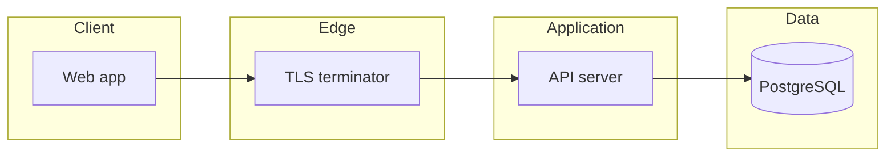

# Task Manager V2 — Architecture

This document describes the target system architecture for the MVP defined in [PRD-task-manager-v2.md](../PRD-task-manager-v2.md). It is meant to guide backend and frontend milestone work (beads **M2** / **M3** under epic `tm-bbw`). For containers, secrets, and `/healthz` / `/readyz` in production, see [DEPLOYMENT.md](./DEPLOYMENT.md).

## 1. Goals and constraints

- **Fast capture and list UX**: API designed for small payloads, indexed queries, and pagination on every collection.
- **Strong tenant isolation**: All domain rows are scoped by `user_id` (see §5). Team/workspace is an optional extension behind the same pattern.
- **Boring, operable stack**: One API process, one PostgreSQL database, explicit SQL migrations, versioned HTTP API under `/api/v1`.
- **Security defaults**: HTTPS in production, hashed passwords (e.g. Argon2id or bcrypt), constant-time comparisons where relevant, rate limits on auth endpoints.

## 2. High-level diagram

- **Web app**: SPA or SSR frontend (out of scope for this doc); talks only to `/api/v1`.
- **API server**: Stateless; holds no user sessions in memory beyond request handling. Persistence is PostgreSQL.
- **PostgreSQL**: Source of truth for users, projects, tasks, tags, and associations.

## 3. Recommended implementation stack (MVP)

| Layer | Choice | Rationale |
|-------|--------|-----------|
| Language / runtime | Go 1.22+ | Matches Gas Town rig patterns; simple deployment; strong stdlib. |
| HTTP router | `chi` or `echo` | Small surface area; middleware-friendly. |
| DB access | `sqlc` + `pgx` (or GORM if team prefers ORM-only) | Migrations stay raw SQL; generated types reduce drift. |
| Migrations | `golang-migrate` or `goose` | PRD asks for migrations; fits CI. |
| Auth | JWT access token (short TTL) + refresh token (rotating, stored hashed in DB) **or** opaque session ID in HTTP-only cookie | PRD allows either; pick one and document in deployment secrets. |
| IDs | UUID v7 (or ULID) as text/bytea | Sortable, safe to expose in URLs. |
| Time | Store `timestamptz` UTC; serialize ISO-8601 in JSON | Avoids client ambiguity. |

Teams may substitute Node + Prisma or similar if they keep the same boundaries and API contract; this architecture is stack-agnostic at the logical level.

## 4. API surface

- **Base path**: `/api/v1` (per PRD).
- **Machine-readable contract**: [openapi.yaml](./api/openapi.yaml) is the source of truth for request/response shapes and error envelopes.
- **Content type**: `application/json` unless noted.
- **Errors**: JSON object with at least `error` (string) and optional `code` (string); failed validation returns `422` with field-level detail where practical.
- **Pagination**: Cursor-based preferred for task lists (`limit`, `cursor`); offset acceptable for MVP if documented.

## 5. Domain model

### 5.1 Core entities

- **User**: Account and profile (`email`, `name`, `password_hash`).
- **Project**: Container for tasks; can be **archived** (soft-delete from default UI).
- **Task**: Primary work item; belongs to one user; optionally linked to one project.
- **Tag**: Normalized label; many-to-many with tasks via `task_tag`.
- **Refresh token** (if JWT refresh flow): One row per issued refresh token (hashed), with `revoked_at`, `expires_at`, `user_id`.

### 5.2 Task attributes (MVP)

Aligned with the PRD; additional field for the Today / Next / Later workflow:

| Field | Type | Notes |
|-------|------|--------|
| `title` | string | Required, max 200. |
| `description` | string | Optional, max 10k. |
| `status` | enum | `todo`, `doing`, `done`. |
| `priority` | enum | `low`, `medium`, `high` (nullable = unset). |
| `due_date` | date (no time) or timestamptz | Optional; PRD uses due dates for views. |
| `focus_bucket` | enum | `none`, `today`, `next`, `later` — supports manual “flag for today” without overloading priority. |
| `assignee_id` | UUID | Optional; use when multi-user / workspace ships. |
| `project_id` | UUID | Optional. |
| `created_at`, `updated_at` | timestamptz | Server-set. |

**Derived views** (optional optimization): The API may implement `view=today|next|later` using rules from the PRD (e.g. Today = `focus_bucket=today` OR due today) while still exposing `focus_bucket` for explicit control.

### 5.3 Indexing (performance)

Per PRD: list and search should stay fast at ~1k tasks per user.

- `(user_id, status, updated_at DESC)` for inbox / status filters.
- `(user_id, due_date)` where `due_date IS NOT NULL`.
- Full-text or `ILIKE` on `(title, description)` with a functional index or `tsvector` if search grows; for MVP, prefix search on `title` may suffice if documented.

## 6. Authentication and authorization

1. **Registration / login** returns credentials per chosen scheme (JWT pair or session cookie).
2. **Every mutating and read request** resolves the current `user_id` from the token/session.
3. **Authorization**: For MVP, every query includes `WHERE user_id = :current` (or join through project owned by user). No cross-user reads.
4. **Optional workspace later**: Introduce `workspace_id` on projects/tasks and membership table; keep API paths backward-compatible via `/api/v2` if rules diverge.

## 7. Deployment topology (MVP)

- **API**: Single binary behind Fly.io, Kubernetes, or similar; `PORT` from environment.
- **Database**: Managed PostgreSQL; `DATABASE_URL` secret.
- **Migrations**: Run as release step (`/app/migrate` or job) before traffic shift.
- **CORS**: Allow frontend origin only; credentials mode if using cookies.

## 8. Observability

- Structured logs (JSON) with `request_id`, `user_id` (when authenticated), route, latency, status.
- Metrics: RPS, error rate, p95 latency per route; DB pool stats.
- Health: `GET /healthz` and `GET /readyz` at the **root** of the service (not under `/api/v1`) — optional but recommended for orchestrators (see OpenAPI).

## 9. Relationship to milestones

- **M1 (this doc + OpenAPI)**: Freezes contracts for parallel frontend/backend work.
- **M2**: Implements handlers, persistence, and migrations matching OpenAPI; seeds dev data.
- **M3**: Implements PRD navigation and quick-add against the same API.

## 10. Open questions (track as follow-up beads if needed)

- **Auth mechanism**: Cookie session vs JWT — pick one before first deploy and reflect in OpenAPI `securitySchemes`.
- **Team MVP**: If shipped, add `workspace` resource and adjust scoping rules in §5–§6.
- **Search**: Confirm MVP query semantics (substring vs full-text) against the 250 ms / 1k tasks criterion.
